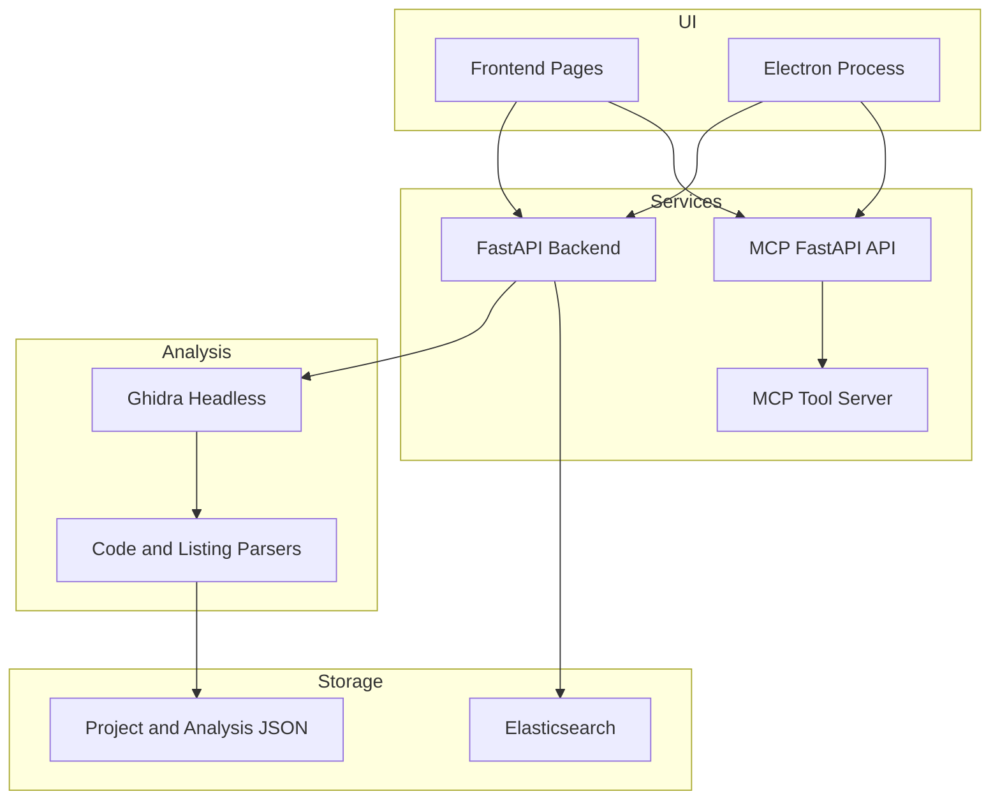

# Architecture

## High-Level Design

MicroTrace is split into independently understandable layers:

- **UI layer**
  Vite-rendered frontend pages plus Electron shell logic
- **Backend layer**
  FastAPI service for projects, settings, graph data, and analysis
- **MCP layer**
  FastAPI wrapper plus MCP tool server and LLM orchestration
- **Persistence layer**
  JSON project state, analysis artifacts, and Elasticsearch-backed register search

## Architecture Diagram

## Code Boundaries

| Area | Main location |
| --- | --- |
| Electron startup and process management | `electron/` |
| Frontend UI and logic | `Frontend/` and `src/` |
| Backend API and orchestration | `backend/microtrace_backend/` |
| MCP service and tools | `mcpServer/` |

## Request Flow Summary

### Project analysis

`Frontend -> backend API -> analysis service -> Ghidra -> parsers -> artifact store -> frontend`

### MCP chat

`MCP UI -> MCP API -> MCP client -> LLM + MCP tools -> MCP API -> MCP UI`
