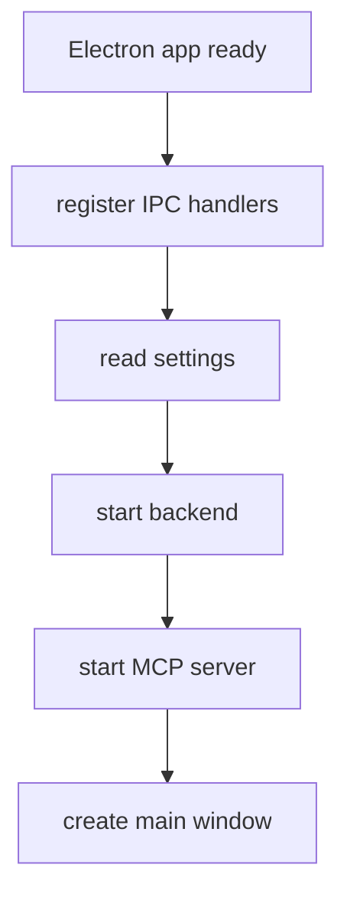

# Frontend and Electron

## Frontend Responsibilities

The frontend provides:

- landing and informational pages
- upload and project management screens
- graph visualization
- MCP chat interface
- settings screen

## Key Entrypoints

| File | Purpose |
| --- | --- |
| `src/upload.ts` | project upload and analysis actions |
| `src/functionGraph.ts` | graph page orchestration |
| `src/settings.ts` | Ghidra settings UI |
| `src/mcpUI.ts` | MCP page bootstrap |
| `src/mcp/client.ts` | MCP UI behavior |
| `src/api.ts` | backend API helper |

## Electron Responsibilities

Electron:

- creates the desktop window
- starts backend and MCP services when needed
- exposes local APIs through preload and IPC
- reads local settings

## Startup Flow



## Example API Helper

```typescript
export const API_V1_URL = `${rawBaseUrl}/api/v1`;
```

This pattern lets the same frontend work:

- in local development
- in Electron
- behind Docker reverse proxy

## MCP Frontend Base URL

The MCP UI reads:

```typescript
import.meta.env.VITE_MCP_API_BASE_URL
```

This was important for Docker because the browser should call `/mcp` instead of a hardcoded local port.
