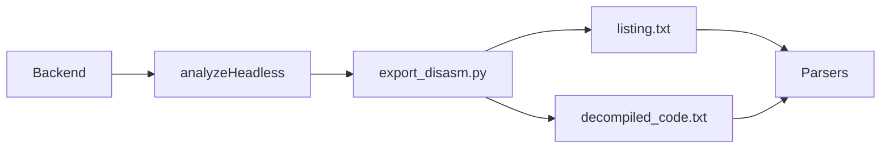

# Ghidra Headless

## Purpose

MicroTrace uses Ghidra headless mode to export the raw analysis artifacts needed by the backend:

- `listing.txt`
- `decompiled_code.txt`
- project-local analysis outputs

## Why Headless Mode Matters

Headless execution lets the platform:

- automate analysis runs from the backend
- avoid GUI-driven manual export
- standardize output locations and arguments
- run in desktop workflows and containerized environments

## Execution Pattern

The backend eventually delegates to the Ghidra launcher with arguments similar to:

```text
analyzeHeadless <project_dir> <project_name> -import <firmware> -scriptPath <script_dir> -postScript export_disasm.py ...
```

## MicroTrace-Specific Role

The backend service:

1. validates the configured Ghidra path
2. creates a new analysis artifact directory
3. calls Ghidra headless
4. expects exported text artifacts
5. parses those artifacts into graph data

## Runtime Relationship



## Local vs Docker

### Local and Electron mode

Users provide a real host path such as:

```text
D:\Tools\ghidra\support\analyzeHeadless.bat
```

### Docker mode

The host Ghidra folder is mounted to `/opt/ghidra`, so the container path becomes:

```text
/opt/ghidra/support/analyzeHeadless
```

## Troubleshooting

### Ghidra path is configured but analysis fails

Check:

- file exists
- path is absolute
- file name is `analyzeHeadless` or `analyzeHeadless.bat`

### Artifacts missing

Check:

- export script exists
- Ghidra returned success
- output directory permissions are valid
