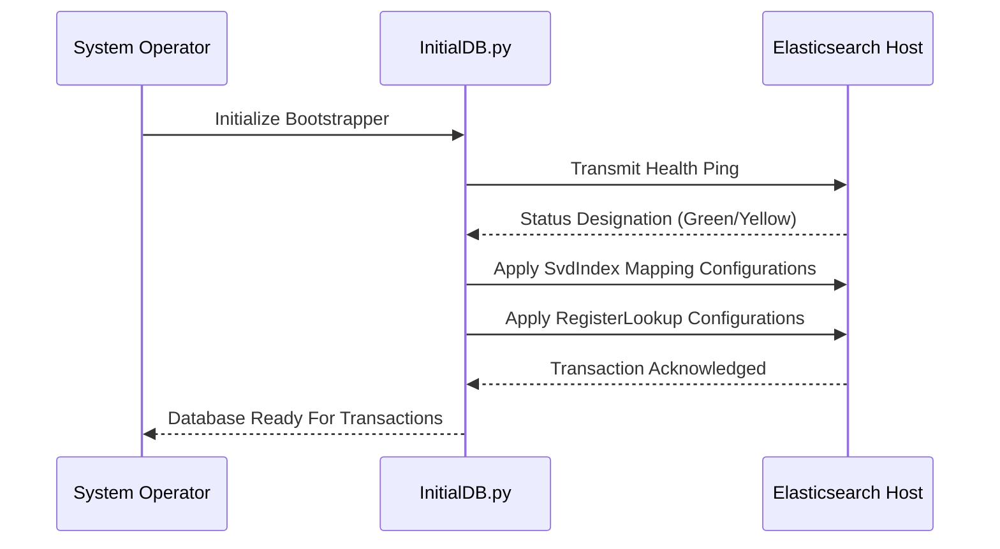

# Elasticsearch Infrastructure

MicroTrace integrates **Elasticsearch** as its primary document indexing and fuzzy retrieval engine. It delivers the low-latency textual and nested data search capabilities necessary for executing complex reverse-engineering operations without degrading algorithmic performance.

## Core Objectives

Analyzing embedded firmware often necessitates cross-referencing substantial quantities of raw hardware definition schemas—most prominently the System View Description (SVD) configurations that declare memory geometries, peripheral mappings, and CPU architecture parameters. 

Standard relational databases are frequently suboptimal for interpreting and querying deep, inconsistently nested XML hardware arrays. Elasticsearch seamlessly fulfills these analysis requirements by providing:
- **Inverted Indices** specialized for immediate substring and token matching.
- **Vector Aggregations** to bucket queries by Microcontroller vendor or localized architecture identifiers.
- **Dynamic Document Mapping** allowing the backend to cleanly ingest diverse schema mappings globally.

---

## Service Topologies

The integration lifecycle is compartmentalized into discrete backend components, primarily localized under the `microtrace_backend/services/` directory:

### `SvdIndexService`
Manages the ingestion, transformation, and ultimate database storage of SVD schema data.
- **Parsing Matrix:** Extracts the relevant definitions from SVD nodes distributed by OEM vendors.
- **Data Normalization:** Restructures disjointed nodes—such as memory base addresses offset by interrupt configurations—into streamlined JSON documents.
- **Index Administration:** Provisions optimized indices explicitly designed for SVD lookup constraints.

### `RegisterLookupService`
Acts as the consumer-facing gateway for reverse-engineering search requests.
- **Fuzzy Resolution:** Grants analytical endpoints (e.g., the User Interface, Ghidra extensions, or MCP instances) the capacity to query localized registers by partial name, description, or memory sector constraint.
- **Hydrated Responses:** Collates address offsets, operational read/write permissions, and CPU reset thresholds into contextually dense serialization models.

---

## Bootstrapping Sequence

Before system analytics can occur on a fresh host, the corresponding Elasticsearch parameters must be generated and applied. This process is commanded by the standalone `InitialDB.py` script.

!!! note "Deployment Orchestration"
    In default deployments, the backend expects an active Elasticsearch container synchronized via `docker-compose.yml`. Always verify your `.env` variables align with the Docker host networking endpoints prior to executing the initialization scripts.
