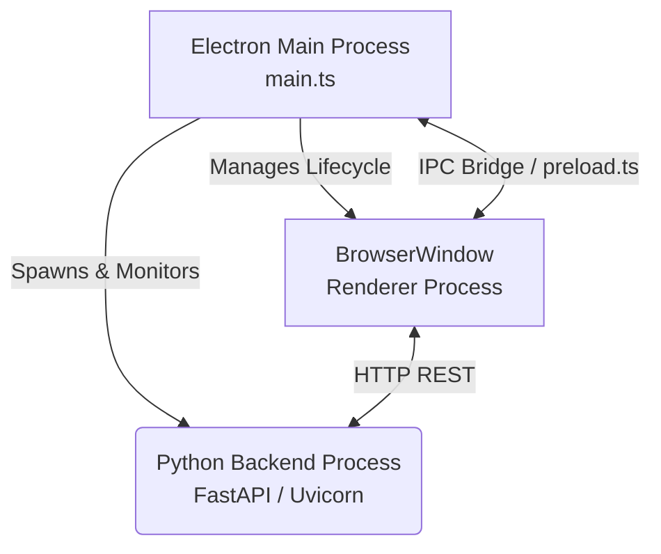

# Electron Client Architecture

The Electron client serves as the primary desktop wrapper for MicroTrace, encapsulating both the frontend visualization environment and managing the lifecycle of the local Python backend API. 

## Architectural Overview

MicroTrace utilizes a multi-process architecture facilitated by Electron. This design segregates the application into distinct execution contexts to prioritize security and performance:

### 1. Main Process (`main.ts`)
The Main Process operates within a complete Node.js environment and acts as the application's orchestrator.
- **Bootstrapping:** Initializes the application framework and configures operating system policies.
- **Backend Orchestration:** Defers the instantiation of the frontend `BrowserWindow` until the Python backend registers a healthy status.
- **Window Management:** Handles the creation, visibility states, and resource destruction of the graphical user interfaces.

### 2. Backend Server Management (`backendServer.ts`)
To ensure a zero-configuration deployment for the end-user, the Electron shell includes dedicated logic to manage the Python execution runtime.
- Dynamically allocates an available network port on the local host interface.
- Spawns the uvicorn backend execution as a managed child process.
- Implements resilient polling against the backend's `/health` endpoint to verify readiness.
- Hooks into the Electron `before-quit` event to gracefully terminate the spawned process, explicitly preventing dangling orphan processes.

### 3. IPC Architecture (`ipc.ts` & `preload.ts`)
The application adheres strictly to Electron's isolation security standards. The renderer (frontend) process is sandboxed and completely removed from accessing Node.js APIs directly.
- **Context Isolation:** Communication between the Vite frontend and the Electron backend occurs exclusively through a strongly-typed Inter-Process Communication (IPC) bridge defined within `preload.ts`.
- **Native Operations:** Operations requiring systemic access—such as native OS directory dialogs, secure credential storage (`settingsStore.ts`), and localized file system polling—are safely invoked via asynchronous IPC context handlers.

### 4. Renderer Process
The sandboxed user interface environment. 
- In a local development environment, the `ELECTRON_RENDERER_URL` environment variable signals Electron to proxy browser requests to the Vite Hot-Module Replacement (HMR) server.
- In distributed environments, the renderer reads static, transpiled assets bundled mechanically by Vite.

---

## Development & Debugging

When extending the features of the MicroTrace Electron shell:
1. Ensure any newly introduced functionality crosses the security boundary securely by registering IPC channels in both `ipc.ts` (Main implementation) and `preload.ts` (Renderer blueprint).
2. For troubleshooting backend synchronization delays, observe the subprocess stdout/stderr forwarded directly to the main terminal console by `backendServer.ts`.
