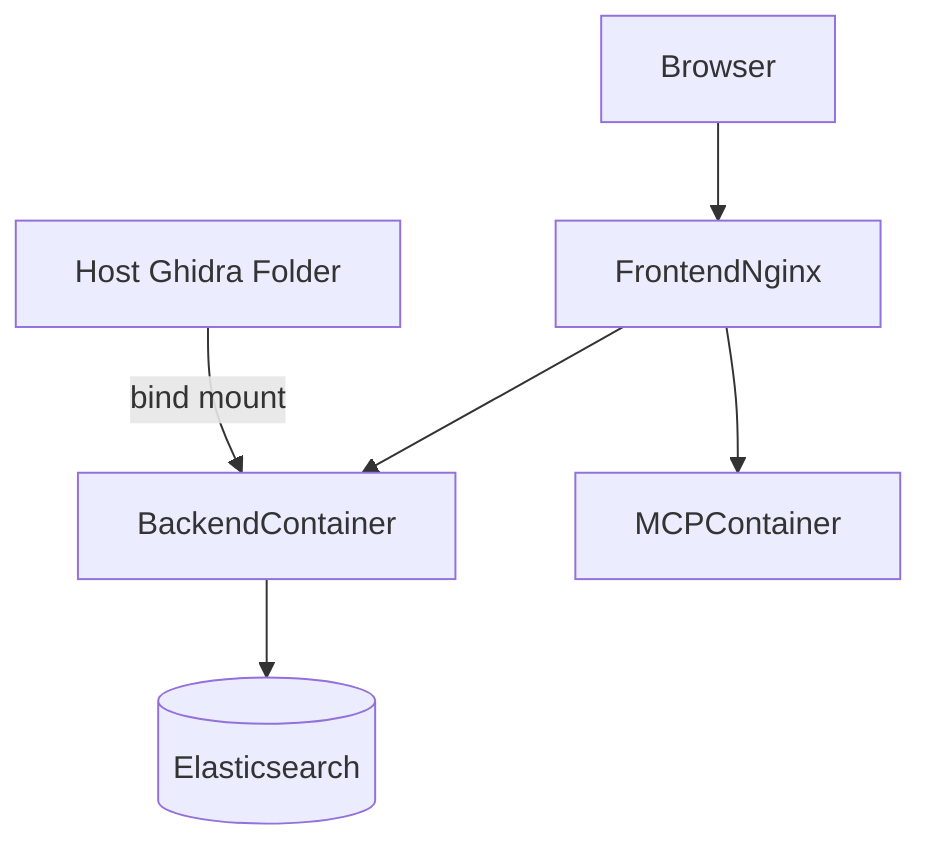

# Docker Deployment

## Services Included

The Docker setup includes:

- `frontend`
- `backend`
- `mcpserver`
- `elasticsearch`

## Required `.env` Setup

Create a repo-root `.env` file and set:

```env
GHIDRA_HOST_PATH=D:\Omar\ghidra_11.4.2_PUBLIC
```

On Linux:

```env
GHIDRA_HOST_PATH=/opt/ghidra/ghidra_11.4.2_PUBLIC
```

## Start the Stack

```bash
docker compose up --build
```

## Access Points

| URL | Purpose |
| --- | --- |
| `http://localhost:8080` | Frontend entrypoint |
| `/api/*` | Reverse-proxied backend APIs |
| `/mcp/*` | Reverse-proxied MCP service APIs |

## Container Data Flow



## Important Behavior

In Docker mode:

- the **host path** comes from `.env`
- the **container path** becomes `/opt/ghidra`
- the backend expects `/opt/ghidra/support/analyzeHeadless`

The UI may still show the configured Ghidra value, but the actual host mount must exist before containers start.

## Health Check Expectations

| Service | Health endpoint |
| --- | --- |
| backend | `/api/v1/health` |
| mcpserver | `/health` |
| elasticsearch | `/_cluster/health` |

## Example Restart Flow

```bash
docker compose down
docker compose up --build
```
