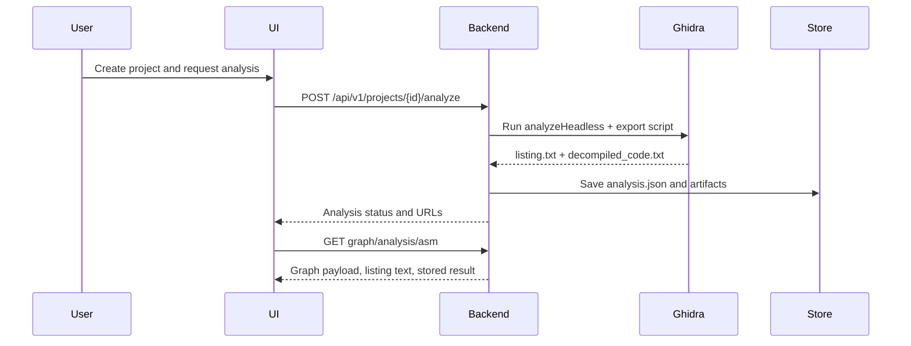

# Platform Overview

## Runtime Modes

MicroTrace currently supports three practical ways to run:

1. **Local development**
   Run the frontend, backend, and MCP services from source.
2. **Electron desktop**
   Launch the packaged desktop shell that starts backend services for the user.
3. **Docker stack**
   Run frontend, backend, MCP server, and Elasticsearch as containers.

## Main Components

| Component | Technology | Responsibility |
| --- | --- | --- |
| Frontend | TypeScript + Vite | Graphs, dashboard, upload flow, MCP UI |
| Electron | Electron + Node | Desktop shell and local process startup |
| Backend | FastAPI | Projects, settings, analysis orchestration, graph APIs |
| MCP Service | FastAPI | AI chat, model settings, MCP tool orchestration |
| MCP Tool Server | Python + MCP | Register, PDF, and search tools |
| Database | Elasticsearch | Register and SVD-backed search |

## Analysis Lifecycle

## Where To Go Next

- To start coding locally, read [Local Development](local-development.md)
- To run the full stack in containers, read [Docker Deployment](docker.md)
- To learn the day-to-day workflow, read [Desktop Workflow](../user-guide/desktop-workflow.md)
