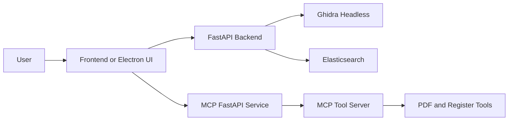

# Documentation Overview

This section contains the full product documentation for MicroTrace.

## Product Summary

MicroTrace helps users reverse engineer embedded firmware by combining static analysis, project management, graph visualization, register search, and an AI-assisted MCP workflow.

## Core Capabilities

- Upload firmware projects and manage analysis runs
- Execute Ghidra headless analysis and store artifacts
- Parse decompiled code and assembly listings into graph-friendly structures
- Search register and peripheral data through Elasticsearch
- Use an MCP-based assistant for register extraction, PDF tooling, and guided analysis
- Run locally in Electron or as a containerized web stack

## Platform Topology

## Who Should Use Which Section

| Section | Best for |
| --- | --- |
| Getting Started | First-time setup and choosing a runtime mode |
| User Guide | Analysts, testers, students, and operators |
| Developer Guide | Contributors and maintainers |
| Reference | API consumers, Docker users, and automation scripts |
