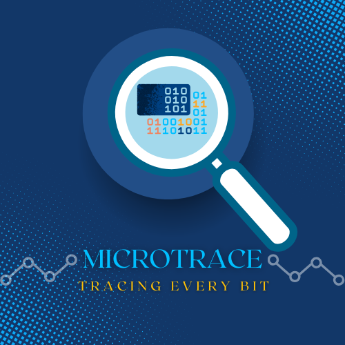

# MicroTrace Overview

> An intelligent system for firmware reverse engineering, component classification, and vulnerability analysis.

---

  

---

## Table of Contents

- [Project Overview](#project-overview)
- [Project Phases](#project-phases)

  - [Phase 1 – SBOM Extraction and Visualization](#phase1)
  - [Phase 2 – AI-Driven Analysis and Vulnerability Detection](#phase2)

- [Key Technologies](#key-technologies)
- [Time Plan](#time-plan)
- [Final Outcomes](#final-outcomes)
- [Use Cases](#use-cases)

---

## Project Overview

**MicroTrace** is a research and development project designed to automatically generate a **Software Bill of Materials (SBOM)** from **bare-metal embedded firmware**.
By reverse-engineering binaries and analyzing function patterns, MicroTrace identifies software layers such as **MCAL**, **HAL**, **Middleware**, and **Application logic**, and presents them through an **interactive web visualization**.

The project integrates reverse engineering, AI, and cybersecurity to improve **firmware transparency**, **vulnerability detection**, and **supply chain security**.

---

## Project Phases

### Phase 1 – SBOM Extraction and Visualization 

**Goal:** Build an automated pipeline that extracts functions from a firmware binary, classifies them into layers, and visualizes the architecture as an interactive graph.

**Workflow:**

1. **Input:** Upload a `.elf` or `.bin` firmware file.
2. **Disassembly & Function Extraction:** Use **Ghidra Headless** to extract functions, symbols, and call relationships. Export results as structured JSON.
3. **Component Classification (MCAL/HAL):** Detect MCAL, HAL, and main/application logic modules.
4. **Frontend Visualization:** Display results on a **web-based Node Graph**.
5. **RAG Assistant Integration:** Enable natural-language queries about hardware registers or function purposes.

**Deliverables:**

- Automated disassembly backend
- MCAL/HAL classification system
- AI datasheet assistant prototype
- Web UI for function visualization

---

### Phase 2 – AI-Driven Analysis and Vulnerability Detection 

**Goal:** Use AI and vulnerability data to identify unknown functions, detect reused libraries, and flag potential security risks.

**Workflow:**

1. **AI-Based Function Mapping:** Fingerprint unknown code and match against known libraries.
2. **Vulnerability Detection:** Check libraries against **CVE databases** and alert users to risks.
3. **Plagiarism & Similarity Analysis:** Detect code reuse or intellectual property violations.

**Deliverables:**

- AI-based library and function classifier
- CVE lookup and vulnerability reporting module
- SPDX/CycloneDX SBOM exporter
- Enhanced dashboard with alerts and recommendations

---

## Key Technologies

| Component               | Tool / Framework                   | Purpose                            |
| ----------------------- | ---------------------------------- | ---------------------------------- |
| Disassembly & Analysis  | Ghidra Headless, Capstone, Radare2 | Extract functions and instructions |
| Pattern Matching        | MCAL/HAL rules                     | Detect known low-level code        |
| AI Assistant (RAG)      | LangChain / LlamaIndex             | Query hardware datasheets          |
| Frontend Visualization  | React + D3.js / Cytoscape.js       | Interactive function graph         |
| Vulnerability Detection | NVD API / CVE Feeds                | Identify known CVEs                |
| SBOM Format             | SPDX / CycloneDX                   | Standardized compliance reports    |

---

## Time Plan

| Phase      | Duration               | Milestones                                                |
| ---------- | ---------------------- | --------------------------------------------------------- |
| Week 1–2   | Setup                  | Repo initialization, architecture design, sample firmware |
| Week 3–5   | Disassembly            | Automate Ghidra extraction and JSON output                |
| Week 6–8   | Classification         | Develop and test MCAL/HAL rules                           |
| Week 9–10  | Visualization          | Implement frontend graph with live data                   |
| Week 11–12 | RAG Assistant          | Embed datasheets and test AI queries                      |
| Week 13–14 | Fingerprinting         | Train/test AI model for unknown functions                 |
| Week 15–17 | Vulnerability Analysis | CVE integration and SBOM export                           |
| Week 18+   | Final Integration      | System testing, frontend polish, finalize documentation   |

---

## Final Outcomes

- Automated **SBOM extractor**
- Interactive **code architecture graph**
- **AI assistant** for hardware and logic analysis
- Integrated **vulnerability and compliance scanner**
- Optional **code similarity / plagiarism detection**

---

## Use Cases

- Firmware Security Auditing
- Supply Chain Verification
- Reverse Engineering and Learning
- Intellectual Property Protection
- Embedded Software Education

---

<b>MicroTrace — Bridging Embedded Systems, Security, and AI</b>

