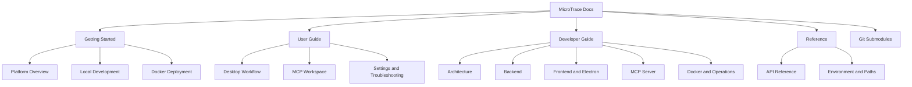

# MicroTrace Documentation

MicroTrace is a firmware analysis platform that combines:

- an Electron desktop app
- a TypeScript frontend
- a FastAPI backend for projects and analysis
- an MCP-powered AI workspace
- Elasticsearch-backed register lookup
- optional Docker deployment for the whole stack

## What This Documentation Covers

This documentation set is split into two main audiences:

- **Users**
  Users who want to configure Ghidra, analyze firmware, inspect results, and work with the MCP assistant.
- **Developers**
  Contributors who need to understand architecture, APIs, runtime behavior, Docker deployment, and documentation workflow.

## Documentation Map


```mermaid
flowchart TD
    A[MicroTrace Docs] --> B[Getting Started]
    A --> C[User Guide]
    A --> D[Developer Guide]
    A --> E[Reference]
    A --> F[Git Submodules]

    B --> B1[Platform Overview]
    B --> B2[Local Development]
    B --> B3[Docker Deployment]

    C --> C1[Desktop Workflow]
    C --> C2[MCP Workspace]
    C --> C3[Settings and Troubleshooting]

    D --> D1[Architecture]
    D --> D2[Backend]
    D --> D3[Frontend and Electron]
    D --> D4[MCP Server]
    D --> D5[Docker and Operations]

    E --> E1[API Reference]
    E --> E2[Environment and Paths]
```

## Quick Start Paths

=== "Run Locally"

    ```bash
    npm install
    npm run dev
    ```

=== "Run Desktop App"

    ```bash
    npm install
    npm start
    ```

=== "Run With Docker"

    ```bash
    Copy-Item .env.example .env
    docker compose up --build
    ```

## Recommended Reading Order

1. Start with [Platform Overview](getting-started/overview.md)
2. Choose [Local Development](getting-started/local-development.md) or [Docker Deployment](getting-started/docker.md)
3. For day-to-day usage, read [Desktop Workflow](user-guide/desktop-workflow.md)
4. For AI tooling, read [MCP Workspace](user-guide/mcp-workspace.md)
5. For implementation details, read [Architecture](developer-guide/architecture.md)
