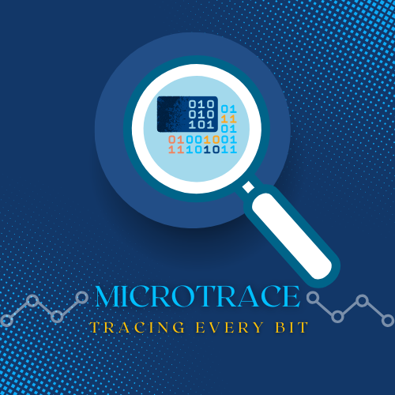
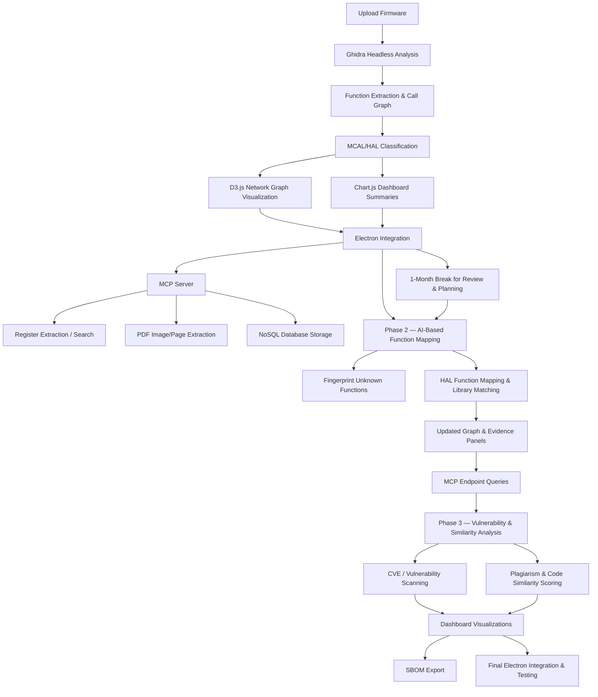

# MicroTrace Overview

> **MicroTrace** is an intelligent system for automated firmware reverse engineering, function-level understanding, component classification, and vulnerability analysis.
> It transforms raw embedded firmware binaries into interactive visualizations, SBOM reports, and AI-assisted insights.

---

  

---

## What MicroTrace Does

MicroTrace analyzes bare-metal firmware (ARM Cortex-M, STM32, etc.) and automatically extracts:

- **Functions, call graphs, and code structure**
- **MCAL, HAL, Middleware, and Application layers**
- **Function similarity and library reuse**
- **Vulnerability insights (CVE mapping)**
- **Plagiarism / code reuse analysis**
- **SBOM generation** (SPDX / CycloneDX)

It provides:

- A **D3.js-powered network graph** of firmware internals
- A **Chart.js dashboard** for vulnerability + similarity metrics
- An **MCP server AI assistant** that can run internal analysis tools

Supported inputs: **`.bin`, `.elf`, `.axf`**

---

# Architecture

MicroTrace consists of four core components:

## 1. Firmware Analysis Engine (Ghidra)

- Fully automated **Ghidra Headless** analysis
- Function extraction, call graph generation, symbol discovery
- Structured JSON output:

  - Functions
  - Basic blocks
  - Callers / callees
  - Strings/constants
  - Metadata (size, address, complexity)

## 2. AI Function Mapping Engine

- Fingerprinting of unknown functions
- Matching against a **reference library corpus**
- HAL function purpose identification
- Similarity clustering and library reuse detection
- Evidence-driven matches (constants, CFG shapes, instruction patterns)

## 3. MCP Server (AI Assistant + Tool Runner)

The RAG system has been fully replaced with an **MCP-based assistant** capable of:

- **Register extraction** from STM32 datasheets
- **Register search** (full name, short name, fuzzy)
- **PDF image/page extraction**
- Executing curated **Python analysis tools** in a sandbox
- Providing contextual AI reasoning over extracted firmware data
- **NoSQL database** backend to store extracted registers, function mappings, and analysis metadata

## 4. Frontend Visualization (Electron + D3.js + Chart.js)

- Electron shell (Phase 1 final integration)
- **D3.js** interactive node graph for functions/call relations
- **Chart.js** dashboard for CVEs, component composition, similarity metrics
- Material-for-MkDocs documentation for developer/operator teams

---

# Project Phases

MicroTrace progresses through three major phases.

---

## Phase 1 — SBOM Extraction & Interactive Visualization

**Status:** ~12 weeks completed, **final integration still pending**

### Goals

- Disassembly pipeline
- Function & call graph extraction
- MCAL/HAL classification
- Initial MCP server skeleton
- D3.js graph + Chart.js summaries
- Prepare for full Electron integration

### Outputs

- Ghidra headless firmware analysis (supports `.bin`, `.elf`, `.axf`)
- Canonical JSON schema
- Interactive D3.js function graph
- Summary charts (layer distribution, complexity, etc.)
- First integration milestone and Electron refactor

---

## Phase 2 — AI-Based Function Mapping

**Estimated Duration:** **2 weeks → 1 month**

### Goals

- Fingerprint unknown functions
- Match against known library corpora
- Map HAL functions to specific HAL APIs
- Provide match evidence + confidence scoring
- Expose search capabilities through MCP server

### Outputs

- Library-matching engine (ANN index + feature extractor)
- HAL function identification
- MCP endpoints for fingerprint queries
- Updated UI with match overlays in the graph

---

## Phase 3 — Vulnerability & Similarity Analysis Dashboard

### Goals

- Vulnerability mapping (CVE/NVD)
- Plagiarism/similarity scoring
- Dashboard for alerts, triage, and remediation
- SBOM export (SPDX / CycloneDX)
- Full MCP integration for launching risk scans

### Outputs

- Vulnerability report engine
- Similarity analysis module
- Chart.js dashboards (severity charts, heatmaps, summaries)
- SBOM exporters (SPDX / CycloneDX)
- Final integrated reporting suite

---

## pipeline

```mermaid
flowchart TD
    A[Upload Firmware] --> B[Ghidra Headless Analysis]
    B --> C[Function Extraction & Call Graph]
    C --> D[MCAL/HAL Classification]
    D --> E[D3.js Network Graph Visualization]
    D --> F[Chart.js Dashboard Summaries]
    E --> G[Electron Integration]
    F --> G

    G --> H[MCP Server]
    H --> I[Register Extraction / Search]
    H --> J[PDF Image/Page Extraction]
    H --> K[NoSQL Database Storage]

    %% Phase 2
    G --> L[Phase 2 — AI-Based Function Mapping]
    L --> M[Fingerprint Unknown Functions]
    L --> N[HAL Function Mapping & Library Matching]
    N --> O[Updated Graph & Evidence Panels]
    O --> P[MCP Endpoint Queries]

    %% Phase 3
    P --> Q[Phase 3 — Vulnerability & Similarity Analysis]
    Q --> R[CVE / Vulnerability Scanning]
    Q --> S[Plagiarism & Code Similarity Scoring]
    R --> T[Dashboard Visualizations]
    S --> T
    T --> U[SBOM Export]
    T --> V[Final Electron Integration & Testing]

    %% Optional: Break after Phase 1
    G --> W[1-Month Break for Review & Planning]
    W --> L
```

# Technology Stack

| Component                 | Technology                            | Purpose                                               |
| ------------------------- | ------------------------------------- | ----------------------------------------------------- |
| Disassembly               | **Ghidra Headless**                   | Extraction of functions, call graph, symbols          |
| Analysis & Fingerprinting | Python (NumPy, scikit-learn/FAISS)    | Feature vectors, similarity indexes                   |
| AI Assistant              | **MCP Server**                        | Tool execution + contextual reasoning                 |
| Datasheet Tools           | MCP-based Python utilities            | Register extraction, PDF parsing, image extraction    |
| Frontend                  | **Electron**, **D3.js**, **Chart.js** | Desktop UI + visual analytics                         |
| Backend Database          | **NoSQL** (MongoDB / similar)         | Stores register data, fingerprints, analysis metadata |
| Documentation             | **Material for MkDocs**               | Project docs and knowledge base                       |
| Reporting                 | SPDX, CycloneDX                       | Standards-based SBOM output                           |

---

# MCP Server Features

### ✔ Register Extraction

Extracts registers, addresses, reset values, descriptions, page ranges from STM32 PDFs.

### ✔ Register Search

Fuzzy/full/partial matching for any register.

### ✔ PDF Image & Page Extraction

Renders entire pages or extracts embedded images.

### ✔ Tool Execution

Runs curated Python analysis scripts (sandboxed).
Used for fingerprinting, CVE checking, similarity scoring.

### ✔ NoSQL Database Storage

Stores register data, function fingerprints, library matches, and analysis metadata for fast retrieval and historical tracking.

---

# Time Plan

| Duration   | Task                                          | Milestones                                                                         |
| ---------- | --------------------------------------------- | ---------------------------------------------------------------------------------- |
| Week 1–2   | Setup                                         | Repo initialization, architecture design, sample firmware                          |
| Week 3–5   | Disassembly                                   | Automate Ghidra extraction and JSON output                                         |
| Week 6–8   | Classification                                | Develop and test MCAL/HAL rules                                                    |
| Week 9–10  | Visualization                                 | Implement frontend D3.js graph and Chart.js summaries                              |
| Week 11–12 | MCP Assistant (Phase 1 skeleton)              | Integrate basic MCP endpoints, register extraction/search                          |
| Week 13–16 | **Break**                                     | Pause development for review, feedback, and planning for Phase 2                   |
| Week 17–20 | Phase 2 — Function Mapping                    | Fingerprint unknown functions, HAL mapping, library matching                       |
| Week 21–24 | Phase 3 — Vulnerability & Similarity Analysis | CVE integration, plagiarism/similarity scoring, dashboard development              |
| Week 25+   | Final Integration                             | Electron full integration, MCP tool execution, testing, SBOM export, documentation |

---

# Use Cases

- Firmware supply-chain analysis
- Security auditing and vulnerability triage
- HAL/MCAL reverse engineering
- Intellectual property verification
- Education and research in embedded security

---

# Summary

MicroTrace provides a unified platform for firmware understanding, AI-driven function analysis, and vulnerability reporting. With a firm foundation in Ghidra analysis, an MCP-based assistant with NoSQL storage, and a clean visualization layer inside Electron, it makes bare-metal firmware **transparent, auditable, and explainable**.