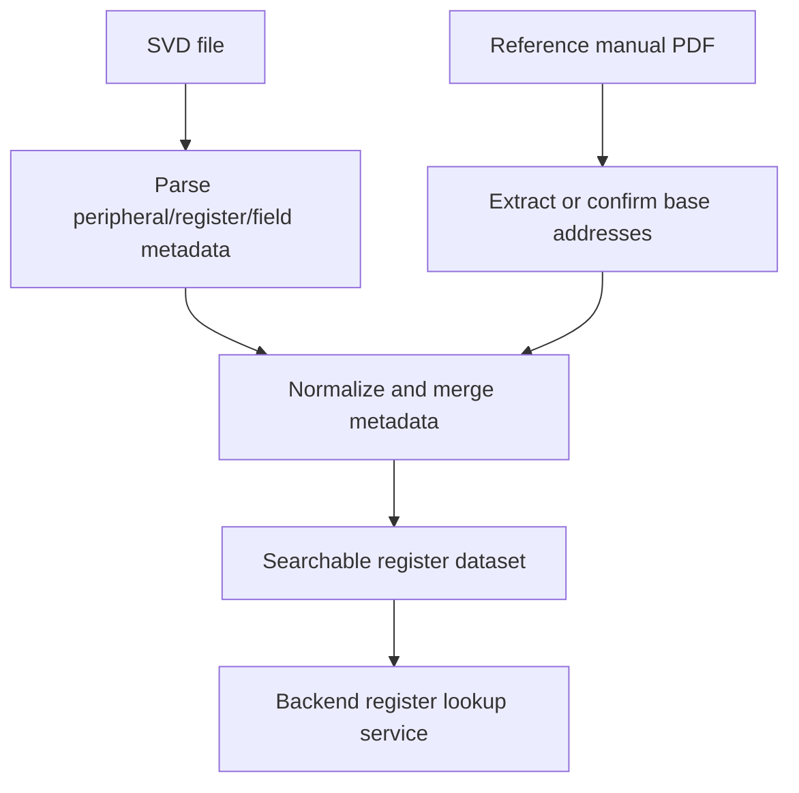

# SVD Database

## Purpose

MicroTrace uses SVD-backed register information to enrich function analysis and support register search.

This data is ultimately used to:

- map addresses and registers to peripherals
- improve register search responses
- enrich analysis nodes with hardware context

## What the Data Represents

Typical register records include:

- peripheral name
- peripheral base address
- register name
- register description
- field names and bit positions
- normalized address values

## Conceptual Model



## How It Helps the Product

The backend register lookup service can use this structured data to:

- answer `/api/v1/registers` queries
- enrich pointer references detected during analysis
- give more meaningful peripheral context in UI displays

## Example Query

```http
GET /api/v1/registers?q=USART&size=20
```

## Typical Record Shape

```json
{
  "PERIPHERAL": "FLASH",
  "BASEADDRESS": "0X40023C00",
  "REGISTER": "ACR",
  "FIELD": "LATENCY",
  "BITOFFSET": 0,
  "BITWIDTH": 3
}
```

## Notes

The old SVD database notes were retained conceptually because the topic is still useful, but they have been rewritten to fit the current MicroTrace architecture and backend usage.
