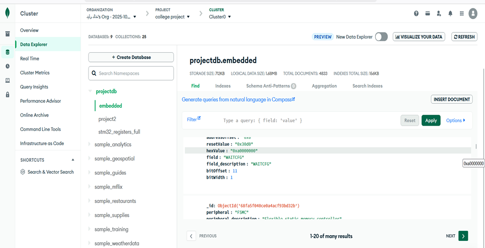

# System View Description (SVD) Database Subsystem

## Architectural Purpose

This integration module is engineered to systematically parse ARM CMSIS System View Description (SVD) XML definitions and supplemental Reference Manual PDF documents corresponding to the STM32 microcontroller portfolios. 

The primary objective is the extraction of embedded peripheral layouts, specific register addresses, and individual operational bit-fields. These discrete data points are flattened and persisted into a **MongoDB** no-SQL document collection, generating a highly query-optimized repository. 

This indexed dataset empowers the broader MicroTrace ecosystem—particularly the forensic analysis tools and documentation generators—to rapidly cross-reference literal memory offsets against human-readable component behaviors.

---

## Module Dependencies

The operational logic relies on native Python data structures alongside precise third-party ingest engines:

```python
import os, sys, re, io, copy
import xml.etree.ElementTree as ET
from pymongo import MongoClient
import fitz, pytesseract
from PIL import Image
```

**Key Responsibilities:**
- `xml.etree.ElementTree`: Navigates complex SVD topological schemas.
- `pymongo`: Facilitates secure transactional handshakes with the MongoDB Atlas endpoints.
- `fitz` & `pytesseract`: Extracts vectorized typography and executes Optical Character Recognition (OCR) against poorly structured reference PDFs.

---

## Execution Components

### 1. Database Instantiation
Establishes a secure TLS-encrypted session with the external MongoDB deployment, verifying host connectivity via protocol pings before initializing collection operations.

```python
def connect():
    client = MongoClient(MONGO_URI, tls=True)
    client.admin.command("ping")
    return client[DB][COL]
```

### 2. Peripheral Base Address Verification (PDF Parsing)
Because SVD files occasionally omit exact peripheral absolute bases, this subroutine intelligently scans the manufacturer's Reference Manual. It extracts memory tables via text streaming and heavily leans on OCR when the documents represent rasterized images. 

```python
def extract_pdf_bases(path):
    if not os.path.exists(path):
        return {}
    txt = ""
    for page in fitz.open(path):
        text_content = page.get_text()
        if len(text_content.strip()) < 40:
            img = Image.open(io.BytesIO(page.get_pixmap(dpi=200).tobytes("png")))
            text_content = pytesseract.image_to_string(img)
        txt += text_content + "\n"
        
    bases = {}
    for match in re.finditer(r"([A-Z][A-Z0-9_]+)[^\w]{0,10}(0x[0-9A-Fa-f]{6,8})", txt):
        bases[match.group(1)] = match.group(2).upper()
    return bases
```

### 3. XML Hierarchy Decoupling (`derivedFrom`)
SVD architectures utilize a `derivedFrom` inheritance model to conserve document weight. The parsing logic recursively expands these parent-child derivations to produce isolated, independent data clusters without manual validation.

```python
def expand(peripherals, name, seen=None):
    if name not in peripherals:
        return None
    seen = seen or set()
    if name in seen:
        return None
    
    seen.add(name)
    node = peripherals[name]["raw"]
    base_target = peripherals[name]["derived"]
    
    if base_target:
        base_node = expand(peripherals, base_target, seen)
        if base_node is not None:
            merged = copy.deepcopy(base_node)
            for child in node:
                if child.tag in ["registers", "clusters"]:
                    for old in merged.findall(child.tag):
                        merged.remove(old)
                merged.append(copy.deepcopy(child))
            merged.find("name").text = node.findtext("name")
            merged.find("baseAddress").text = node.findtext("baseAddress", merged.findtext("baseAddress", "0x0"))
            return merged
    return node
```

### 4. Database Ingestion Output
Each resolved cluster generates a comprehensive flat JSON record suitable for high-speed indexing within the NoSQL architecture.

```json
{
  "PERIPHERAL": "FLASH",
  "DESCRIPTION": "Flash memory control registers",
  "BASEADDRESS": "0X40023C00",
  "REGISTER": "ACR",
  "REGISTER_DESCRIPTION": "Flash access control register",
  "ADDRESSOFFSET": "0X0",
  "RESETVALUE": "0X20",
  "HEXADDRESS": "0X40023C00",
  "FIELD": "LATENCY",
  "FIELD_DESCRIPTION": "Latency configuration",
  "BITOFFSET": 0,
  "BITWIDTH": 3
}
```

!!! note "Visual Output Validation"
    The finalized database cluster provides a highly auditable schema accessible through standard DB administration interfaces, ensuring clean interoperability with MicroTrace querying subroutines.

