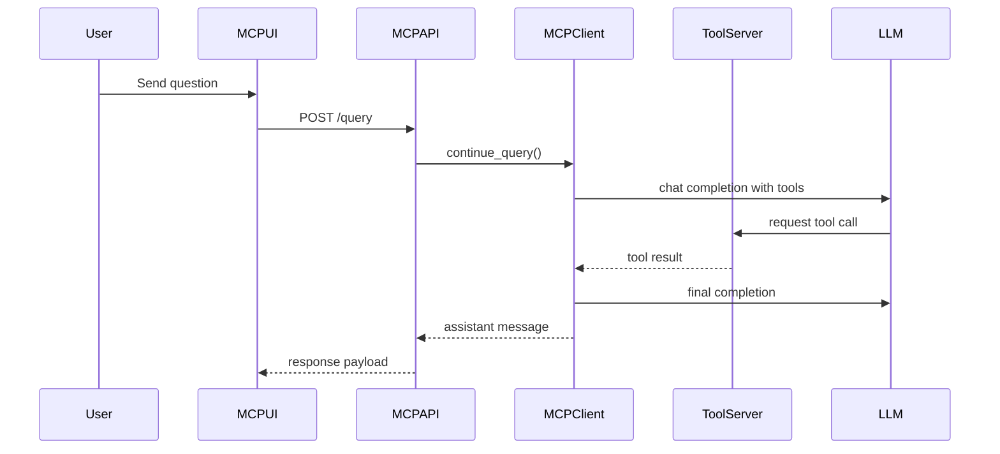

# MCP Workspace

## What the MCP Workspace Does

The MCP UI is the assistant-oriented workspace in MicroTrace. It provides:

- chat sessions
- provider switching between OpenAI, Gemini, LM Studio, and Ollama
- automatic base URL updates and model autocomplete for hosted providers
- quick actions for PDF and register tooling
- refreshable trusted local custom tools
- model configuration and persistence

## Quick Actions

The UI exposes common tool-assisted workflows:

- extract registers from a datasheet PDF
- search for a register
- search the live web when an online search API key is configured
- fetch a specific register with detail
- extract images from a PDF
- read PDF table of contents
- run online search
- list loaded custom tools and their exact `TOOL_NAME` values
- run a named custom MCP tool with JSON arguments

The composer also has separate send modes:

- **Online Search** uses the `online_search` MCP tool and returns current web-backed context.
- **Deep Research** performs a structured firmware/project analysis using the current conversation and MCP tools. It may use `online_search` only when current web context is genuinely useful.

## Online Search

The assistant can use the `online_search` MCP tool for current vendor documentation, datasheet pages, security advisories, and general technical lookup. It works immediately with a no-key DuckDuckGo fallback.

For better reliability and structured results, configure at least one provider key:

```env
BRAVE_SEARCH_API_KEY=your_brave_key
```

or:

```env
TAVILY_API_KEY=your_tavily_key
```

Then reconnect or refresh the MCP tools from the UI so the assistant uses the API-backed provider.

## Custom Tools

Advanced users can add trusted local Python tools under:

```text
mcpServer/custom_tools/
```

Copy `example_tool.py.example` to a `.py` file, edit the tool name, description, JSON input schema, and `run()` function, then press **Refresh MCP tools**.

Use **List custom tools** before running one. The runnable MCP tool name must match the `TOOL_NAME` value inside the Python file, not the file name.

When you choose **Run custom tool**, the tool-name field suggests detected working custom tools as you type. It is still editable, so you can type an exact `TOOL_NAME` manually if needed.

Custom tools are local code execution. Only add code you trust.

## Supported Model Providers

| Provider | Typical Base URL |
| --- | --- |
| OpenAI | `https://api.openai.com/v1` |
| Gemini | `https://generativelanguage.googleapis.com/v1beta/openai/` |
| LM Studio | `http://127.0.0.1:1234/v1` |
| Ollama | `http://127.0.0.1:11434/v1` |

## MCP Request Path



## Example Configuration Save

```json
{
  "provider": "gemini",
  "model": "gemini-2.5-flash",
  "base_url": "https://generativelanguage.googleapis.com/v1beta/openai/",
  "api_key": "your_gemini_api_key"
}
```

## Good Operational Advice

!!! tip
    Use Gemini or OpenAI when you want hosted models, LM Studio for local desktop inference, and Ollama when you want a local OpenAI-compatible endpoint with easy model management.
