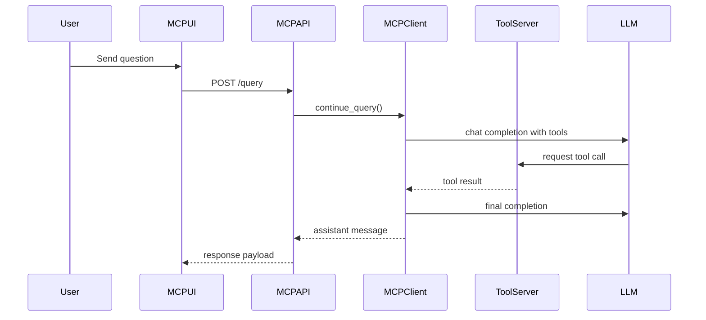

# MCP Workspace

## What the MCP Workspace Does

The MCP UI is the assistant-oriented workspace in MicroTrace. It provides:

- chat sessions
- provider switching between OpenAI, LM Studio, and Ollama
- quick actions for PDF and register tooling
- model configuration and persistence

## Quick Actions

The UI exposes common tool-assisted workflows:

- extract registers from a datasheet PDF
- search for a register
- fetch a specific register with detail
- extract images from a PDF
- read PDF table of contents

## Supported Model Providers

| Provider | Typical Base URL |
| --- | --- |
| OpenAI | `https://api.openai.com/v1` |
| LM Studio | `http://127.0.0.1:1234/v1` |
| Ollama | `http://127.0.0.1:11434/v1` |

## MCP Request Path



## Example Configuration Save

```json
{
  "provider": "ollama",
  "model": "llama3.1:8b",
  "base_url": "http://127.0.0.1:11434/v1",
  "api_key": ""
}
```

## Good Operational Advice

!!! tip
    Use OpenAI when you want hosted models, LM Studio for local desktop inference, and Ollama when you want a local OpenAI-compatible endpoint with easy model management.
